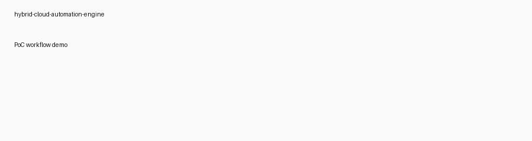

# hybrid-cloud-automation-engine

Cloud-Native Multi-Cloud VPN Gateway — a reproducible, IaC-first reference for connecting an on-prem (Raspberry Pi / VM) network to OCI and AWS using Terraform and Ansible.

[](./LICENSE)
[](https://github.com/careed23/hybrid-cloud-automation-engine/actions)
[](https://github.com/careed23/hybrid-cloud-automation-engine/actions)

Release
-------
This repository contains the initial public PoC (v1.0.0). See `RELEASE.md` for the release notes and changelog. Use the included `scripts/publish_repo.ps1` helper to push and configure repository settings once you've authenticated `gh` locally.

Why this project
- Infrastructure as Code: Terraform modules for OCI (VCN) and AWS (VPC) show reusable infra code.
- Hybrid networking: Demonstrates cross-cloud connectivity using wireguard/OpenVPN and automated instance configuration via Ansible.
- Security-first: Emphasis on encrypted VPN tunnels, least-privilege security groups, and minimal public surface.

What you'll find

Architecture diagram
- Editable source: `docs/architecture.drawio` (open in https://app.diagrams.net/ or https://www.draw.io/).
- Exported images (committed): `docs/architecture.svg` and `docs/architecture.png` (SVG is the canonical, high-fidelity export).


Demo
----
A short animated demo placeholder is included below — replace `docs/demo.gif` with a short screen capture (2–6s) showing terraform apply -> inventory generation -> ansible run for a quick visual in your README.



Why this design
- Hybrid connectivity: an on-prem gateway (Raspberry Pi/VM) establishes encrypted tunnels to cloud peers in OCI and AWS. This demonstrates extending an internal network into multiple clouds while keeping control of routing and security.
- Separation of concerns: Terraform modules define reusable network constructs (VCN/VPC) while Ansible handles node-level configuration (WireGuard keys/configuration).
- Security-first: WireGuard provides modern, lightweight encryption; security lists and security groups in the examples are intentionally minimal for a PoC (SSH + WireGuard). For production, restrict CIDRs and use secret management for keys.

Sample cost estimate (PoC)
- AWS: 1 x t3.micro EC2 instance (on-demand) — free tier eligible in many accounts; EBS gp3 small volume (~8GB). Estimate: $0–$10/month depending on free-tier and region if run continuously.
- OCI: VM.Standard.E2.1.Micro or equivalent — free tier eligible in many regions. Estimate: $0–$10/month.
- Data transfer: Minimal for control/health checks; cross-cloud data egress can dominate costs. For a low-traffic PoC (health pings, small config sync), egress will likely be under $1/month. For production traffic, consult provider egress pricing.

Cost optimization tips
- Use free-tier-eligible shapes and only run VMs when testing. Destroy resources after demos.
- Keep the bulk of data local (on-prem) and avoid transferring large backups across tunnels.
- Use ephemeral resources for testing (spot/preemptible instances) where acceptable.

Quickstart (short)
------------------
1) Clone the repo:

```powershell
git clone https://github.com/careed23/hybrid-cloud-automation-engine.git
cd hybrid-cloud-automation-engine
```

2) Prepare variables: copy `examples/terraform/terraform.tfvars.example` to `examples/terraform/terraform.tfvars` and fill in cloud-specific values (OCI compartment OCID, OCI image OCID if used, etc.).

3) Use the Makefile (or PowerShell wrapper) to provision and generate inventory:

```powershell
# Initialize
make init

# Plan and apply (review plan output first)
make plan
make apply

# Generate Ansible inventory from Terraform outputs
make gen-inventory

# Run Ansible playbook to deploy WireGuard
ansible-playbook -i ansible/inventory.tf.ini ansible/site.yml
```

Or on Windows you can run the convenience wrapper:

```powershell
.\scripts\deploy_and_inventory.ps1 -AutoApprove
ansible-playbook -i ansible/inventory.tf.ini ansible/site.yml
```

4) Verify the tunnel and run the health check script either as a cron job or as a scheduled function.


Quick start (developer machine)
1) Fill in cloud credentials as appropriate (AWS CLI / OCI credentials or environment variables).
2) Review and customize the Terraform modules in `modules/*` (variables are exposed for cloud-specific IDs).
3) Run Terraform to provision the VMs/instances.
4) Use Ansible to install WireGuard on the instances and configure the tunnel.
5) Deploy the health-check script as a cron job, or put it into a Lambda function (adjust mode to HTTP/webhook-based alerting).

Cost and optimization
- Keep instance sizes small: use t3.micro / t4g.micro (AWS free-tier where applicable) and equivalent OCI shapes.
- Keep NAT / egress minimal: place only required services in public subnets and avoid large cross-cloud transfers where possible.
- Use local on-prem device (Raspberry Pi) to reduce continual cloud-hosted routing costs during testing.
- Tear down resources when not in use.

Next steps and optional enhancements
- Add a complete Terraform root that composes the two modules and creates the instances and security groups.
- Add GitHub Actions to plan/apply Terraform with a protected environment and secrets.
- Add a production-grade alerting integration (Slack or PagerDuty) for the health-check.

What I added in this repo
- Example Terraform root: `examples/terraform` shows how to call the `modules/aws` and `modules/oci` modules and optionally create small instances (when you provide AMI/image IDs).
- Ansible role: `ansible/roles/wireguard` implements a small role that generates keys and deploys a `wg0` configuration template.
- Site playbook: `ansible/site.yml` runs the role and prints out public keys to help with manual exchange for PoC setups.
- CI workflow: `.github/workflows/ci.yml` runs unit tests and checks Terraform formatting.

Cost and Free-Tier optimizations
- Use the smallest instance shapes for demos: AWS `t3.micro`/`t4g.micro` and OCI `VM.Standard.E2.1.Micro` where available.
- Prefer regional small instances with ephemeral storage for short-lived PoCs to avoid block storage costs.
- Keep data transfer low: run tests that avoid moving large data across tunnels; prefer control plane checks and small pings.
- Destroy resources when idle: add a `make destroy` or `terraform destroy` step in automation to remove running instances when not in use.

How to run the unit tests locally
1) Create and activate the venv (this repo auto-configures a venv when using the editor integration).
2) Install dependencies:

```powershell
D:/hybrid-cloud-automation-engine/.venv/Scripts/python.exe -m pip install -r requirements.txt
```

3) Run tests:

```powershell
D:/hybrid-cloud-automation-engine/.venv/Scripts/python.exe -m pytest -q
```

CI
- The `ci.yml` workflow runs the unit tests and checks Terraform formatting on PRs and pushes to `main`/`master`.

Security note
- The sample Ansible playbook and Terraform examples are intentionally minimal. For production use, integrate a secrets manager (Vault, AWS Secrets Manager, OCI Vault) to store WireGuard private keys, and use least-privilege IAM roles for provisioning.

Author: Architect-friendly reference. Use and adapt freely for demos or PoCs.
