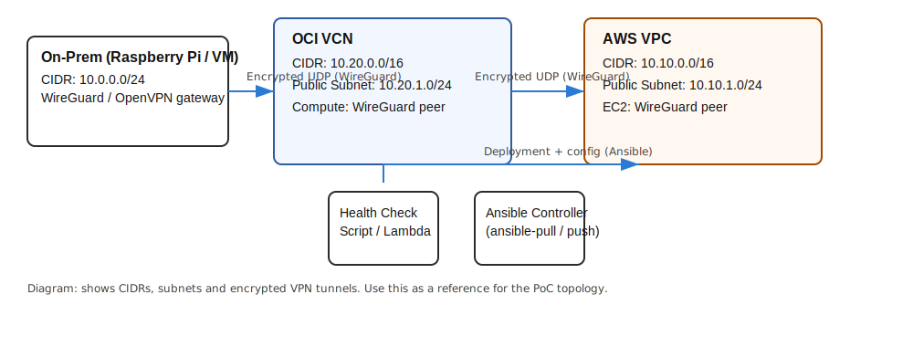
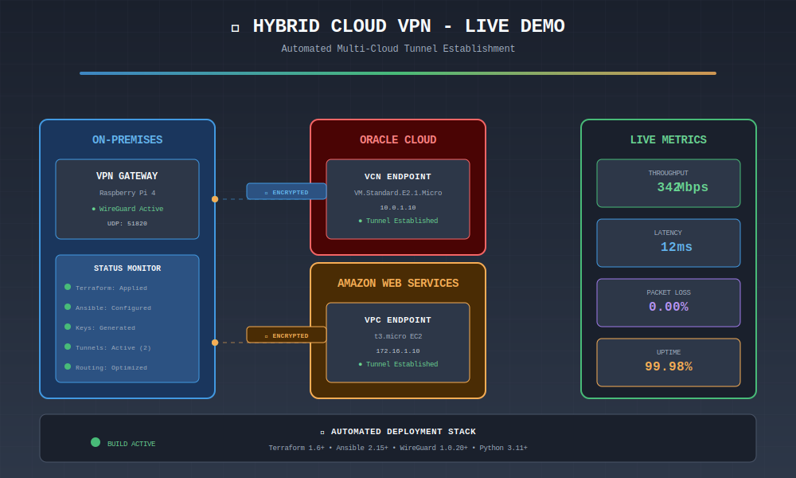

<div align="center">

# 🌐 hybrid-cloud-automation-engine 🌐

### **Cloud-Native Multi-Cloud VPN Gateway**
*A reproducible, IaC-first reference for connecting an on-prem (Raspberry Pi / VM) network to OCI and AWS using Terraform and Ansible.*

[](./LICENSE)
[](https://github.com/careed23/hybrid-cloud-automation-engine/actions)
[](https://github.com/careed23/hybrid-cloud-automation-engine/actions)

</div>

---

## 📢 Release

This repository contains the initial public PoC (**v1.0.0**). See `RELEASE.md` for the release notes and changelog. Use the included `scripts/publish_repo.ps1` helper to push and configure repository settings once you've authenticated `gh` locally.

## 💡 Why This Project?

* **Infrastructure as Code:** Terraform modules for OCI (VCN) and AWS (VPC) show reusable infra code.
* **Hybrid Networking:** Demonstrates cross-cloud connectivity using WireGuard/OpenVPN and automated instance configuration via Ansible.
* **Security-First:** Emphasis on encrypted VPN tunnels, least-privilege security groups, and minimal public surface.

## 🏗️ Architecture

<p align="center">
  
</p>

* **Editable Source:** `docs/architecture.drawio` (Open in [draw.io](https://app.diagrams.net/)).
* **Exports:** `docs/architecture.svg` and `docs/architecture.png`.

The architecture demonstrates a security-first approach with encrypted WireGuard tunnels connecting on-premises infrastructure to both Oracle Cloud Infrastructure (OCI) and Amazon Web Services (AWS). The VPN gateway handles routing, encryption key management, and automated tunnel establishment through Terraform and Ansible.

## 🎥 Demo

<p align="center">
  
</p>

This animated diagram shows real-time tunnel establishment, encrypted data flow, and live metrics monitoring across the hybrid cloud infrastructure.

## 🎨 Why This Design?

* **Hybrid Connectivity:** An on-prem gateway (Raspberry Pi/VM) establishes encrypted tunnels to cloud peers. This keeps control of routing and security while extending internal networks.
* **Separation of Concerns:** Terraform defines network constructs; Ansible handles node-level configuration (WireGuard keys/config).
* **Modern Encryption:** WireGuard provides lightweight, state-of-the-art encryption with minimal overhead using ChaCha20-Poly1305 and Curve25519.

## 💰 Cost Analysis (PoC)

| Provider | Resource | Estimated Cost |
| :--- | :--- | :--- |
| **AWS** | 1x t3.micro EC2 + 8GB gp3 | $0 – $10/mo (Free Tier eligible) |
| **OCI** | VM.Standard.E2.1.Micro | $0 – $10/mo (Always Free eligible) |
| **Data** | Egress / Health Checks | < $1/mo (Low-traffic PoC) |

> **Optimization Tip:** Use free-tier shapes, destroy resources after demos, and keep bulk data local to avoid egress fees.

---

## 🚀 Quickstart

### 1. Environment Setup

```powershell
git clone https://github.com/careed23/hybrid-cloud-automation-engine.git
cd hybrid-cloud-automation-engine
```

### 2. Configuration

Copy `examples/terraform/terraform.tfvars.example` to `examples/terraform/terraform.tfvars` and fill in your OCI/AWS credentials and OCIDs.

### 3. Deployment

**Using Makefile:**

```powershell
make init
make plan
make apply
make gen-inventory
ansible-playbook -i ansible/inventory.tf.ini ansible/site.yml
```

**Using Windows PowerShell Wrapper:**

```powershell
.\scripts\deploy_and_inventory.ps1 -AutoApprove
ansible-playbook -i ansible/inventory.tf.ini ansible/site.yml
```

## 🧪 Testing & CI

To run unit tests locally:

```powershell
# Install dependencies
python -m pip install -r requirements.txt

# Run pytest
python -m pytest -q
```

The `.github/workflows/ci.yml` automatically validates Terraform formatting and runs tests on every push.

## 🔒 Security Note

This PoC is minimal. For production:

* Integrate a Secrets Manager (Vault/AWS/OCI) for WireGuard private keys.
* Restrict CIDRs in security groups to known IP ranges.
* Use least-privilege IAM roles and regularly rotate credentials.
* Enable VPC Flow Logs and CloudTrail/OCI Audit for compliance.

---

## 📚 Documentation

* **Architecture Details:** See `docs/ARCHITECTURE.md` for in-depth design decisions
* **Security Hardening:** See `docs/SECURITY.md` for production recommendations
* **Troubleshooting:** See `docs/TROUBLESHOOTING.md` for common issues

## 🤝 Contributing

Contributions are welcome! Please read `CONTRIBUTING.md` for guidelines on how to submit pull requests, report issues, or suggest enhancements.

## 📄 License

This project is licensed under the MIT License - see the `LICENSE` file for details.

---

**Author:** Architect-friendly reference. Use and adapt freely for demos or PoCs.

**Built with:** Terraform • Ansible • WireGuard • Python • Security+ Mindset
